# Keyflow

**Native keyboards. Your app’s style.**

A customizable native keyboard for app-owned React Native text inputs, built with UIKit on iOS and Kotlin on Android. Keep familiar typing interactions while choosing your colors, fonts, key surfaces, and long-press appearance.

**Unpublished preview · iOS + Android · Phones + tablets**

Keyflow recreates keyboard UI; it does not reskin Apple’s keyboard or Gboard. Platform layouts and interactions differ, and some explicit styling still needs cross-platform alignment. See [current limitations](#current-limitations).

[Get started](#get-started) · [Customize](#customization) · [Native-style features](#native-style-features) · [API guide](docs/api.md) · [Example app](#example-app) · [Testing](#testing) · [Limitations](#current-limitations)

## A keyboard that belongs in your app

Use Keyflow with your own single-line or multiline React Native `TextInput`. Paragraphs, wrapped text, native Return behavior, and continuous movement on both trackpad axes are supported.

<table>
<tr><th>Raised surfaces</th><th>Independent transparency</th><th>Your own font</th></tr>
<tr>
<td>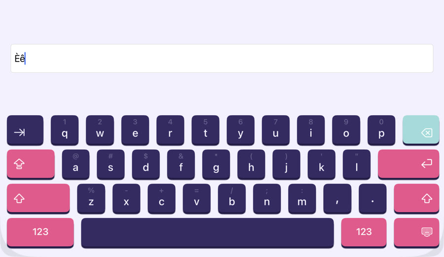</td>
<td>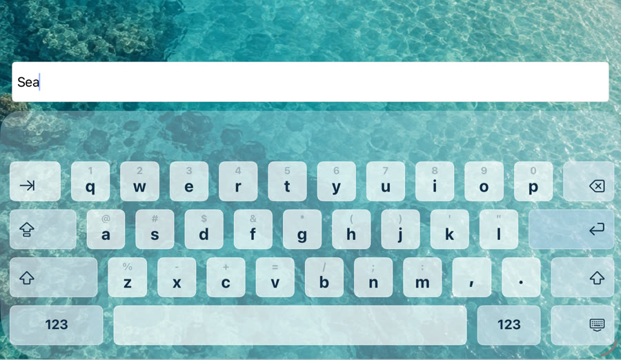</td>
<td>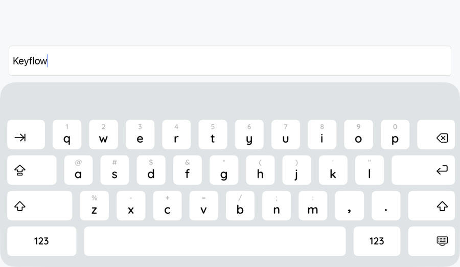</td>
</tr>
</table>

Real iPad example captures. These themes use the public API; Story Studio is example styling, not a library preset. [Media details and recording provenance](docs/media/README.md).

## Get started

The first npm release is being prepared. Until it is published, install a [local package in your app](docs/api.md#compatibility-and-local-installation), or run the example from this repository:

```sh
git clone https://github.com/MeliValesca/react-native-keyflow.git
cd react-native-keyflow
corepack yarn install
corepack yarn build
npm install --global stim@1.2.0
cd example
stim start
stim ios
# Or: stim android
```

The example uses **Expo SDK 57, React Native 0.86.3, and React 19.2.3**. Keyflow requires Expo Modules and a native development or production build; Expo Go is not supported. On web, render your own fallback instead of calling `useKeyflow`; see [web fallback](docs/api.md#web-fallback). The example targets iOS 16.4+ and Android API 24+. See [compatibility and local installation](docs/api.md#compatibility-and-local-installation).

### Your first input

Spread `keyflowInputProps` onto your input. `KeyflowAvoidingView` follows the active Keyflow automatically on both platforms; no ref or keyboard-frame wiring is required.

```tsx
import { useState } from 'react';
import { TextInput, Text } from 'react-native';
import { KeyflowAvoidingView, useKeyflow } from 'react-native-keyflow';
import type { KeyflowThemeOverrides } from 'react-native-keyflow';

const keyflowTheme = {
  keyboard: {
    background: '#F4F0FF',
    cornerRadius: 28,
    borderColor: '#C77DFF',
    borderWidth: 2,
  },
  keys: { background: '#342B62', color: '#FFFFFF' },
  specialKeys: { background: '#E05B8D', color: '#FFFFFF' },
} satisfies KeyflowThemeOverrides;

export function Composer() {
  const [text, setText] = useState('');
  const { keyflowInputProps } = useKeyflow({
    keyflowTheme,
    keyboardMode: 'custom',
    hapticsEnabled: true,
  });

  return (
    <KeyflowAvoidingView
      style={{ flex: 1, justifyContent: 'flex-end', padding: 16 }}
    >
      <Text>Write the next chapter.</Text>
      <TextInput
        {...keyflowInputProps}
        placeholder="Start typing…"
        value={text}
        accessibilityLabel="Message"
        onChangeText={setText}
        style={{
          height: 52,
          paddingHorizontal: 12,
          color: '#192231',
          backgroundColor: '#FFFFFF',
          borderWidth: 1,
          borderColor: '#D1D5DB',
          borderRadius: 8,
        }}
      />
    </KeyflowAvoidingView>
  );
}
```

**Your app owns the input.** Call `useKeyflow(options)` and spread `keyflowInputProps` onto your React Native `TextInput`; these props include its ref and event bindings. This also works with your own input component when it forwards the ref and bindings to a native `TextInput`. Set `style`, `value`/`defaultValue`, placeholder, accessibility props, and text callbacks directly on your input. Keep larger keyboard styling in a reusable `keyflowTheme` constant; it styles Keyflow only.

**Multiline inputs are supported on iOS and Android.** For larger editors, set `multiline` on your input and choose its height or `numberOfLines` yourself:

```tsx
<TextInput
  {...keyflowInputProps}
  multiline
  value={text}
  onChangeText={setText}
  style={{ minHeight: 140, textAlignVertical: 'top' }}
/>
```

On iOS, hold space to enter trackpad mode, then slide in any direction. A floating caret follows the finger freely across letters and blank space inside the input. On release, it snaps to the nearest valid insertion position, including wrapped lines. Android's space-slide gesture supports both directions too. The drag target stays independent of the snapped caret, so short lines do not discard its horizontal position. Return follows your input's React Native `submitBehavior`; multiline inputs insert a newline by default.

For automatic focus, pass `autoFocus: true` to `useKeyflow()` instead of setting it on `TextInput`. Keyflow waits for native attachment before presenting the input.

The hook also exposes stable `focus()` and `blur()` methods. They safely do nothing while the input is unmounted. `inputRef` remains available for other native input methods:

```tsx
import { Button, TextInput } from 'react-native';

const { keyflowInputProps, focus, blur, inputRef } = useKeyflow({
  keyflowTheme,
});

<TextInput {...keyflowInputProps} style={styles.input} />;
<Button title="Focus input" onPress={focus} />;
<Button title="Dismiss input" onPress={blur} />;
// Other native methods remain available, e.g. inputRef.current?.clear().
```

Call `useKeyflow` unconditionally with the component's other hooks. The input itself may render later, such as after a font or other asset loads; Keyflow attaches when that input receives focus. See [the input API](docs/api.md#input-api) for composing callbacks and [keyboard avoidance](docs/api.md#keyboard-avoidance) for navigation headers.

## Customization

Use small section objects. Shared settings live under `font` and `keyboard`; override individual sections only where needed.

```tsx
import { TextInput } from 'react-native';
import { useKeyflow } from 'react-native-keyflow';
import type { KeyflowThemeOverrides } from 'react-native-keyflow';

export const keyflowTheme = {
  keyboard: {
    background: '#F4F0FF',
    cornerRadius: 28,
    borderColor: '#C77DFF',
    borderWidth: 2,
    material: { type: 'raised', depth: 4, shadowColor: '#241D46' },
  },
  font: { size: 20, weight: 'medium' },
  keys: {
    background: '#342B62',
    color: '#F4F0FF',
    cornerRadius: 8,
    pressedBackground: '#55458F',
    pressedColor: '#FFFFFF',
  },
  specialKeys: { background: '#E05B8D', color: '#FFFFFF' },
  returnKey: { background: '#E05B8D', color: '#FFFFFF' },
  deleteKey: { background: '#A8DADC', color: '#241D46' },
  preview: { background: '#342B62', color: '#F4F0FF' },
  selection: { background: '#E05B8D', color: '#FFFFFF' },
} satisfies KeyflowThemeOverrides;

const { keyflowInputProps } = useKeyflow({
  keyflowTheme,
  returnKeyContent: { icon: 'send' },
});

<TextInput {...keyflowInputProps} style={styles.input} />;
```

| Section                   | Controls                                                          |
| ------------------------- | ----------------------------------------------------------------- |
| `keyboard`                | Panel color, opacity, flat or raised material                     |
| `font`                    | Shared font family, size and weight                               |
| `keys`                    | Letter, digit and space-key appearance                            |
| `specialKeys`             | Modifier and layout-switch keys                                   |
| `deleteKey` / `returnKey` | Delete and return appearance                                      |
| `preview`                 | Long-press popup appearance                                       |
| `selection`               | Focused accent appearance; also used by Android’s active Caps key |
| `toolbar`                 | Android clipboard and dismiss controls                            |

Sections support colors, pressed colors, borders, corner radius, fonts, and icon sizing where applicable. The outer panel uses `keyboard.cornerRadius`, `keyboard.borderColor`, and `keyboard.borderWidth`; its border follows the same rounded top edge on iOS and Android. `color` supplies the icon and pressed foreground unless explicitly overridden. If you set `iconColor`, remember to give selected states a contrasting icon color too.

Set the custom return key to app-owned text or a portable native icon:

```tsx
const { keyflowInputProps } = useKeyflow({
  returnKeyContent: { icon: 'send' },
});

<TextInput
  {...keyflowInputProps}
  submitBehavior="submit"
  onSubmitEditing={sendMessage}
/>;
```

Use `{ text: 'Post' }` for app-owned text. Available icons are `return`, `arrow-right`, `checkmark`, `send`, and `search`. This changes only Keyflow's presentation; use the `TextInput`'s `submitBehavior` and `onSubmitEditing` for behavior. A multiline input with `submitBehavior="newline"` inserts `\n`.

For example, these two multiline inputs display different return keys and keep their normal React Native behavior:

```tsx
const { keyflowInputProps: sendInputProps } = useKeyflow({
  returnKeyContent: { icon: 'send' },
});
const { keyflowInputProps: newlineInputProps } = useKeyflow({
  returnKeyContent: { text: 'New line' },
});

// Displays a send icon and calls sendMessage.
<TextInput
  {...sendInputProps}
  multiline
  submitBehavior="submit"
  onSubmitEditing={sendMessage}
/>

// Displays “New line” and inserts a newline.
<TextInput
  {...newlineInputProps}
  multiline
  submitBehavior="newline"
/>
```

The example app has an interactive **Behavior → Return key actions** screen for testing both cases.

On iOS, the long-press accent popup and its choices omit borders. The selected accent uses the regular keys’ corner radius.

The API is shared across phone, tablet, portrait and landscape. Native layout determines the key geometry; customization does not define new rows or touch targets. [Full theme options and limits](docs/api.md#theme-reference).

### Transparent panel, transparent keys—or both

```tsx
const transparentTheme = {
  keyboard: {
    background: '#16324F',
    backgroundOpacity: 0.35,
    keyOpacity: 0.7,
  },
};
const { keyflowInputProps } = useKeyflow({
  keyflowTheme: transparentTheme,
});
```

Both values range from `0` to `1`. Panel opacity and key-surface opacity are independent; text and icons retain their configured colors. Put your background image outside the avoiding view so it can continue beneath the keyboard. The example includes separate 0–100% sliders.

### Use a font bundled with your app

Load the font before rendering the input. With `expo-font`, for example:

```tsx
import { TextInput } from 'react-native';
import { useFonts } from 'expo-font';
import { useKeyflow } from 'react-native-keyflow';

export function BrandedInput() {
  const [loaded, error] = useFonts({
    Quicksand: require('./assets/Quicksand_600SemiBold.ttf'),
  });
  const { keyflowInputProps } = useKeyflow({
    keyflowTheme: {
      font: { family: 'Quicksand', weight: 'medium' },
      keys: { color: '#16324F' },
    },
  });
  if (error) throw error;
  if (!loaded) return null;

  return <TextInput {...keyflowInputProps} style={{ height: 52 }} />;
}
```

Use your own asset path. System aliases (`system-rounded`, `system-serif`, `system-monospace`) are also supported. Missing font names fall back to the system font. See the [custom-font example](example/src/screens/CustomFontScreen.tsx) for loaded weights and validation.

For reusable validated themes, use `createKeyflowTheme(overrides, base)`. Included bases are `lightKeyflowTheme`, `darkKeyflowTheme`, `androidKeyflowTheme`, `androidDarkKeyflowTheme`, and `transparentKeyflowTheme`.

## Native-style features

These behaviors are implemented in **Keyflow’s custom keyboard**. They are inspired by the sampled Apple and Gboard keyboards; “implemented” does not mean every animation, setting or pixel is identical to the system keyboard.

| Behavior                   | iOS / iPadOS                                                                                          | Android                                                                                                 |
| -------------------------- | ----------------------------------------------------------------------------------------------------- | ------------------------------------------------------------------------------------------------------- |
| Typing and editing         | Letters, numbers, symbols, space, return, selected-text replacement and deletion                      | Same core editing operations                                                                            |
| Multiline inputs           | Paragraphs, wrapped lines and native `submitBehavior`                                                 | Same multiline support and native Return behavior                                                       |
| Capitalization             | Sentence capitalization, one-shot Shift, Caps Lock and double-space punctuation                       | Sentence capitalization, one-shot Shift, Caps Lock and double-space punctuation                         |
| Press and hold             | Key previews, accent choices, drag-to-choice with instant highlight switching, held-delete repetition | Key previews, accent/number shortcuts, moving accent highlight, cancellation and held-delete repetition |
| Cursor movement            | Hold space, then drag continuously left/right or up/down                                              | Slide continuously on space in both axes                                                                |
| Layouts                    | iPhone/iPad profiles, portrait/landscape, number/decimal/phone pads                                   | Phone/tablet profiles, portrait/landscape, number/decimal/phone pads                                    |
| Tablet controls            | Functional Tab, Caps Lock, Shift, Delete, Return and dismissal; alternate-character flicks            | Functional Tab, Caps Lock, Shift, Delete, Return and page switching                                     |
| Presentation               | UIKit keyboard presentation/dismissal and keyboard avoidance                                          | App-owned panel presentation/dismissal, Android Back and frame-driven avoidance                         |
| Accessibility and feedback | Key labels, selected-state information, accessible accent actions and optional haptics                | Key labels, selected-state information, accessible accent actions and optional haptics                  |

**Platform-specific details:** iPhone uses a single-row accent presentation; iPad uses its own accent grid. Android adds a clipboard-paste/dismiss toolbar and optional visible number shortcuts on letter keys. Clipboard paste is not a clipboard-history manager.

English/French switching is also implemented, but the globe cycles Keyflow’s configured languages rather than reproducing the complete system language menu. [Language configuration](#layouts-and-languages).

### Default layouts on phones and tablets

<table>
<tr><th>iPhone</th><th>Android phone</th></tr>
<tr>
<td>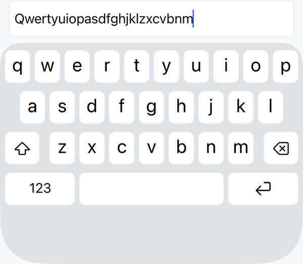</td>
<td>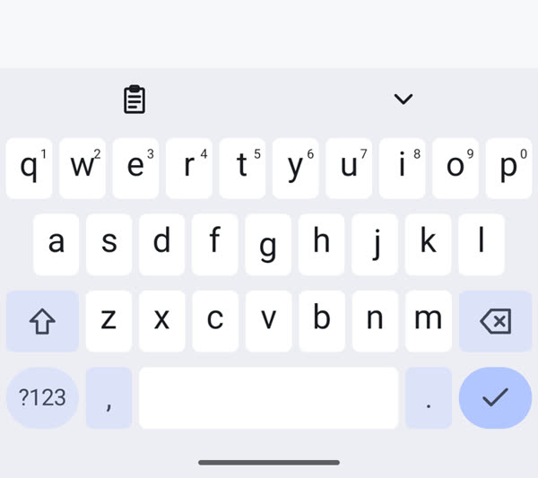</td>
</tr>
<tr><th>iPad</th><th>Android tablet</th></tr>
<tr>
<td>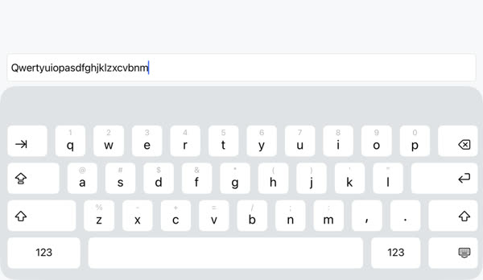</td>
<td>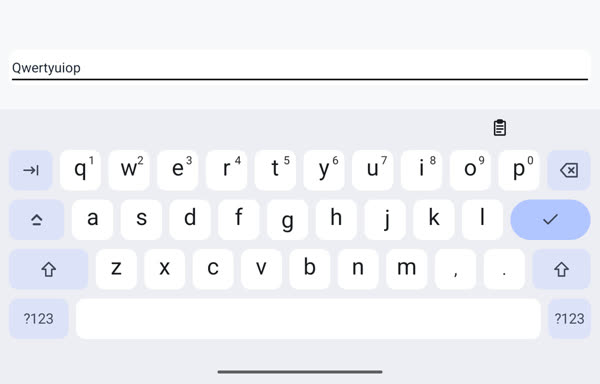</td>
</tr>
</table>

These are **Keyflow**, not the actual system keyboards. The default-layout previews reuse earlier development captures; [capture details and devices](docs/media/development-captures/README.md) are recorded separately from the newer themed videos below. They illustrate the layout families, not a current pixel-parity audit.

### Opening, dismissal and keyboard avoidance

<table>
<tr><th>iPhone · UIKit</th><th>Android phone · Kotlin</th></tr>
<tr>
<td><a href="docs/media/ios-transitions.mp4">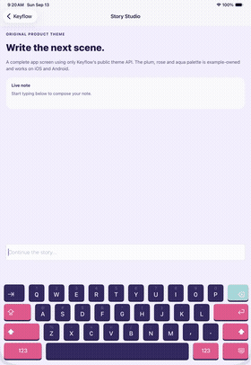</a></td>
<td><a href="docs/media/android-transitions.mp4">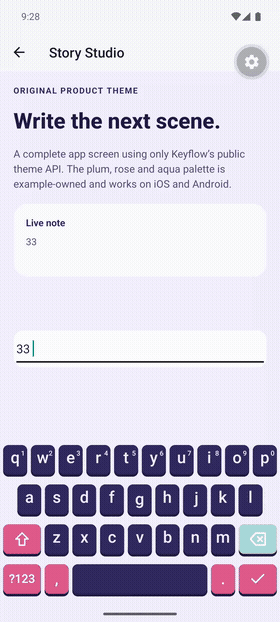</a></td>
</tr>
</table>

Watch the MP4s: [iPhone transitions](docs/media/ios-transitions.mp4) · [Android transitions](docs/media/android-transitions.mp4).

### Long press and accent selection

<table>
<tr><th>iPhone · Hold and slide between accents</th><th>Android phone · Hold and slide between accents</th></tr>
<tr>
<td><a href="docs/media/ios-accents.mp4">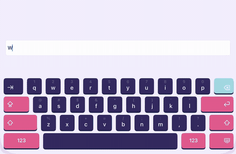</a></td>
<td><a href="docs/media/android-accents.mp4">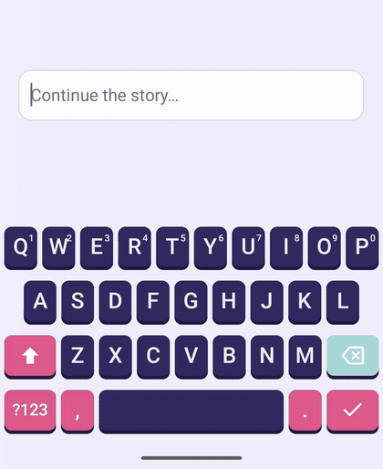</a></td>
</tr>
</table>

Watch the MP4s: [iPhone accent selection](docs/media/ios-accents.mp4) · [Android long press](docs/media/android-accents.mp4).

### Space-bar trackpad

<table>
<tr><th>iPhone · Hold space, then move</th><th>Android phone · Slide on space</th></tr>
<tr>
<td><a href="docs/media/ios-trackpad.mp4">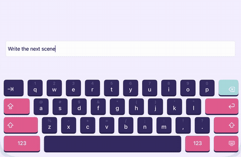</a></td>
<td><a href="docs/media/android-trackpad.mp4">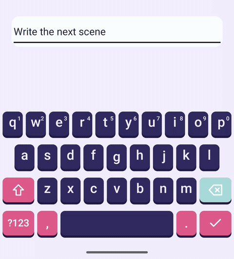</a></td>
</tr>
</table>

Watch the MP4s: [iPhone multiline trackpad](docs/media/ios-trackpad.mp4) · [Android multiline trackpad](docs/media/android-trackpad.mp4).

Accent and trackpad GIFs use 25 fps; transition previews use 12 fps. The MP4s retain the recordings’ timing. Both trackpad clips demonstrate continuous horizontal and vertical movement in a multiline input. These recordings illustrate the named interactions, not native-parity or physical-device performance benchmarks.

The clips demonstrate the named interactions only. The other behaviors in the table are covered by the relevant [native and app test suites](docs/coverage.md), with device-review limits documented there.

## Layouts and languages

```tsx
const { keyflowInputProps } = useKeyflow({
  keyboardType: 'decimal-pad',
  keyboardLanguages: [
    { language: 'en', layout: 'qwerty' },
    { language: 'fr', layout: 'azerty' },
  ],
});

<TextInput
  {...keyflowInputProps}
  keyboardType="decimal-pad"
  style={styles.input}
/>;
```

- Layouts: `default`, `number-pad`, `decimal-pad`, and `phone-pad`.
- Phone/tablet and portrait/landscape layouts are selected internally.
- English and French can be selected through the globe when both are configured.
- Omit `keyboardLanguages` to discover supported device language preferences. Exact software layout preferences are not always exposed by the OS; explicit configuration chooses the template.

Need the user’s actual keyboard and its full feature set? Pass `keyboardMode: 'system'` to the hook. See [mode switching and input props](docs/api.md#input-api) and [language behavior](docs/languages.md).

## Example app

| Category    | Explore                                                                      |
| ----------- | ---------------------------------------------------------------------------- |
| Behavior    | Typing, long presses, return actions, cursor movement and native comparisons |
| Multiline   | Notes with paragraphs, wrapped lines, Return and movement on both axes       |
| Transitions | Presentation, dismissal, mode handoffs and keyboard avoidance                |
| Layouts     | Number pads, rotation, English/French switching                              |
| Appearance  | Fonts, borders, sizes, focused accents and customization bounds              |
| Showcases   | Platform defaults, Story Studio, Quicksand and transparency                  |

The example source lives in [`example/`](example). `corepack yarn example:export` also prepares a standalone example repository under `artifacts/keyflow-example-repo` with a bundled library package.

## Testing

```sh
corepack yarn check
python3 -m unittest discover -s scripts/android-tests -p 'test_*.py' -v
```

CI builds the app and test binaries once per platform, then shares them with parallel phone/tablet test jobs. It also runs library checks. Platform filtering avoids unrelated native jobs; extra device profiles run weekly. Both platforms run native rendering/interaction tests and the actual React Native example. Android phone and tablet also cover multiline editing, trackpad movement, system handoffs, avoidance transitions, customization, transparency, and portrait/landscape layouts.

PR CI runs unit/native tests and focused core interactions on phone and tablet. Exhaustive native keyboard comparisons and visual matrices run locally, manually, and weekly. See [test commands](docs/testing.md), [coverage and limits](docs/coverage.md), and [visual comparisons](docs/visual-feature-tests.md). Passing these checks does not certify every native visual detail, complete VoiceOver/TalkBack navigation, or real-device smoothness.

## Current limitations

### What the custom keyboard does not implement

This comparison describes **Keyflow**, not a restriction on the user’s actual keyboard. Android references are sampled Gboard layouts; there is no single keyboard implementation shared by every Android device.

| Missing capability                   | iOS / iPadOS                                                                                                                  | Android                                                                                                                                         |
| ------------------------------------ | ----------------------------------------------------------------------------------------------------------------------------- | ----------------------------------------------------------------------------------------------------------------------------------------------- |
| Suggestions and automatic correction | No QuickType prediction/completion, automatic word replacement, learned dictionary or system text-replacement engine          | No Gboard/IME prediction/completion, automatic word replacement or personalized suggestion engine                                               |
| Emoji, voice and rich media          | No emoji picker, frequently used emoji, dictation, stickers or Memoji                                                         | No emoji picker, frequently used emoji, voice input, stickers or GIF browser                                                                    |
| Gesture typing and advanced editing  | No QuickPath word entry or full native trackpad-selection gesture set; continuous trackpad cursor movement supports both axes | No glide/swipe word entry, swipe-to-delete-word gesture or complete IME editing toolbar; continuous trackpad cursor movement supports both axes |
| Language engines                     | No non-Latin composition/candidate engines or full system language-switch menu; custom templates are English/French only      | No non-Latin composition/candidate engines or full installed-IME language/settings menu; custom templates are English/French only               |
| Extra keyboard tools                 | No keyboard-owned shortcut/undo/redo toolbar or system personalization controls                                               | No clipboard history/pinning or IME personalization controls; the paste button inserts current clipboard text                                   |
| Alternate keyboard modes             | No iPad floating/split keyboard or iPhone one-handed layout                                                                   | No floating, split, one-handed or user-resized IME layout; no separate Samsung Keyboard/SwiftKey implementations                                |

Use `keyboardMode: 'system'` for the installed keyboard and whatever features its settings, device and language configuration make available. Keyflow cannot apply its theme to that keyboard. Native editor selection handles, context menus or OS-provided editing services may still appear; they are not a custom feature implemented by Keyflow.

### Fidelity and accessibility limits

- **Styling is not fully aligned:** Android’s active Caps key uses `selection`, while iOS modifiers remain under `specialKeys`; explicit radii also receive different platform adjustments. Native icon shapes, alternate-label placement and layout proportions differ.
- **Reference coverage is finite:** the layouts are tuned to sampled docked Apple/Gboard keyboards, not every OS release, OEM, foldable posture or window configuration. The same theme API works across device classes; that is not a promise of identical pixels.
- **Accessibility actions are implemented and tested**, but complete VoiceOver/TalkBack speech, navigation, touch exploration and screen-reader typing modes have not been fully validated.
- **Animation tests are regression checks**, not proof of identical native latency or sustained 60/120-fps performance on physical devices. The documentation GIFs are reduced-frame-rate previews.

### Integration limits

- `useKeyflow` creates a ref for one React Native `TextInput`. Single-line and multiline inputs are supported; arbitrary native editor implementations are not. Input props and controlled values belong to your input; Keyflow does not replace React Native’s editing/event pipeline.
- Supported preview peers are Expo SDK 57, React Native 0.86.x (0.86.3+) and React 19.2.3+. Earlier combinations are not claimed as supported. A native build with Expo Modules is required; Expo Go is unsupported. On web, calling `useKeyflow` throws; provide your own [fallback](docs/api.md#web-fallback).
- Keyflow is an **in-app keyboard library**, not a system-wide keyboard extension/IME that users can install for other apps.

See [automated coverage and remaining manual checks](docs/coverage.md) for the precise boundary of the CI guarantees.

## Contributing

Use the versions pinned in the repository, run the applicable local checks, and submit a PR. Native changes need a rebuild; example TypeScript changes use Fast Refresh.

[Architecture](docs/architecture.md) · [API reference](docs/api.md) · [Verification](docs/verification.md) · [MIT license](LICENSE) · [Third-party notices](THIRD_PARTY_NOTICES.md)
